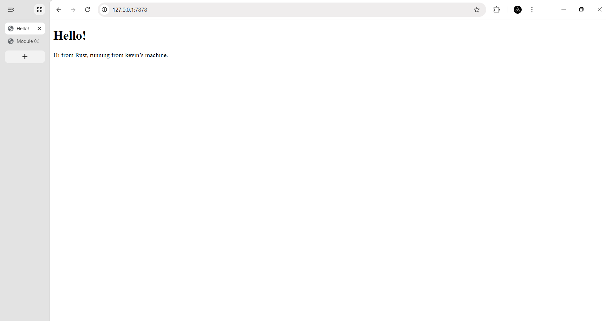

<details>

<summary>Commit 1 Reflection notes</summary>

Pada commit ini, saya membuat sebuah server TCP sederhana yang mendengarkan pada alamat `127.0.0.1:7878`. Aplikasi mendengarkan koneksi masuk dengan menggunakan `TcpListener`, dan setiap kali ada koneksi masuk, aplikasi akan memanggil fungsi `handle_connection` untuk menangani koneksi tersebut. Koneksi yang berupa `TcpStream` akan dibaca menggunakan `BufReader`. Objek `BufReader` digunakan untuk membaca data dari stream secara efisien, dan data yang dibaca akan diubah menjadi sebuah vektor string yang berisi setiap baris dari permintaan HTTP yang diterima. Akhirnya, permintaan HTTP tersebut akan dicetak per baris ke konsol. Output yang dihasilkan menunjukkan permintaan HTTP yang diterima dari klien, termasuk metode HTTP, header, dan informasi lainnya.

Pada kasus saya, permintaan HTTP yang diterima adalah permintaan GET untuk halaman utama ("/"), dan header yang menyertainya mencakup informasi tentang host, koneksi, user-agent, dan preferensi lainnya. Output ini memberikan gambaran tentang bagaimana server TCP menerima dan memproses permintaan HTTP dari klien.

Dari commit ini, saya belajar tentang cara membuat server TCP sederhana menggunakan Rust, bagaimana membaca data dari stream menggunakan `BufReader`, dan bagaimana packet HTTP dikirimkan dari klien ke server, dan cara mengetahui informasi yang terkandung dalam permintaan HTTP. Saya juga belajar tentang struktur dasar dari permintaan HTTP, termasuk metode, header, dan informasi lainnya yang dapat dikirimkan oleh klien. Selain itu, saya memahami bagaimana menggunakan `TcpListener` untuk mendengarkan koneksi masuk dan `TcpStream` untuk berkomunikasi dengan klien.

Contoh keluaran:
```
Request: [
    "GET / HTTP/1.1",
    "Host: 127.0.0.1:7878",
    "Connection: keep-alive",
    "Cache-Control: max-age=0",
    "sec-ch-ua: \"Google Chrome\";v=\"147\", \"Not.A/Brand\";v=\"8\", \"Chromium\";v=\"147\"",
    "sec-ch-ua-mobile: ?0",
    "sec-ch-ua-platform: \"Windows\"",
    "Upgrade-Insecure-Requests: 1",
    "User-Agent: Mozilla/5.0 (Windows NT 10.0; Win64; x64) AppleWebKit/537.36 (KHTML, like Gecko) Chrome/147.0.0.0 Safari/537.36",
    "Accept: text/html,application/xhtml+xml,application/xml;q=0.9,image/avif,image/webp,image/apng,*/*;q=0.8,application/signed-exchange;v=b3;q=0.7",
    "Sec-Fetch-Site: none",
    "Sec-Fetch-Mode: navigate",
    "Sec-Fetch-User: ?1",
    "Sec-Fetch-Dest: document",
    "Accept-Encoding: gzip, deflate, br, zstd",
    "Accept-Language: en-US,en;q=0.9,id;q=0.8",
]
```


</details>

<details>
<summary>Commit 2 Reflection notes</summary>

Pada commit ini, saya menambahkan logika untuk mengirimkan respons HTTP yang sesuai dengan permintaan yang diterima. Setelah membaca permintaan HTTP dari klien, saya memberikan sebuah formatted string sebagai response, string tersebut terdiri dari status line, header `Content-Length`, dan isi dari file `hello.html`. Status line menunjukkan bahwa permintaan berhasil dengan kode status 200 OK. Header `Content-Length` memberikan informasi tentang panjang konten yang akan dikirimkan, yang dihitung berdasarkan panjang isi file `hello.html`. Setelah membentuk response, saya menggunakan metode `write_all` untuk mengirimkan response tersebut ke klien melalui stream. `status_line` dan `Content-Length` harus dipisahkan dengan `\r\n` untuk mematuhi format HTTP, dan setelah header, saya menambahkan dua baris baru (`\r\n\r\n`) untuk menunjukkan akhir dari header dan awal dari body response. Dengan perubahan ini, server sekarang dapat merespons permintaan HTTP dengan mengirimkan konten yang sesuai kepada klien. 

Karena client menerima response yang valid, maka browser akan menampilkan isi dari file `hello.html` yang berisi pesan "Hello, World!" di halaman utama. Output yang dihasilkan menunjukkan bahwa server berhasil merespons permintaan HTTP dengan mengirimkan konten yang sesuai. Dari commit ini, saya menyadari bahwa HTTP hanya merupakan protokol teks, sehingga kita dapat membentuk response HTTP dengan menggunakan string yang diformat dengan benar. Saya juga belajar tentang pentingnya menyertakan header `Content-Length` dalam response HTTP untuk memberi tahu klien tentang panjang konten yang akan diterima. Selain itu, saya memahami bagaimana menggunakan metode `write_all` untuk mengirimkan data ke klien melalui stream.



</details>