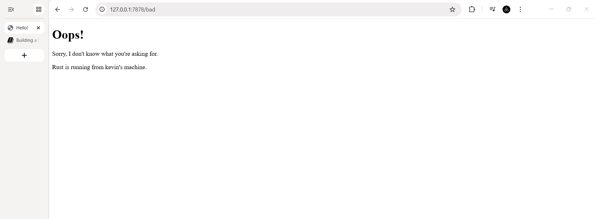

<details>

<summary>Commit 1 Reflection notes</summary>

Pada commit ini, saya membuat sebuah server TCP sederhana yang mendengarkan pada alamat `127.0.0.1:7878`. Aplikasi mendengarkan koneksi masuk dengan menggunakan `TcpListener`, dan setiap kali ada koneksi masuk, aplikasi akan memanggil fungsi `handle_connection` untuk menangani koneksi tersebut. Koneksi yang berupa `TcpStream` akan dibaca menggunakan `BufReader`. Objek `BufReader` digunakan untuk membaca data dari stream secara efisien, dan data yang dibaca akan diubah menjadi sebuah vektor string yang berisi setiap baris dari permintaan HTTP yang diterima. Akhirnya, permintaan HTTP tersebut akan dicetak per baris ke konsol. Output yang dihasilkan menunjukkan permintaan HTTP yang diterima dari klien, termasuk metode HTTP, header, dan informasi lainnya.

Pada kasus saya, permintaan HTTP yang diterima adalah permintaan GET untuk halaman utama ("/"), dan header yang menyertainya mencakup informasi tentang host, koneksi, user-agent, dan preferensi lainnya. Output ini memberikan gambaran tentang bagaimana server TCP menerima dan memproses permintaan HTTP dari klien.

Dari commit ini, saya belajar tentang cara membuat server TCP sederhana menggunakan Rust, bagaimana membaca data dari stream menggunakan `BufReader`, dan bagaimana packet HTTP dikirimkan dari klien ke server, dan cara mengetahui informasi yang terkandung dalam permintaan HTTP. Saya juga belajar tentang struktur dasar dari permintaan HTTP, termasuk metode, header, dan informasi lainnya yang dapat dikirimkan oleh klien. Selain itu, saya memahami bagaimana menggunakan `TcpListener` untuk mendengarkan koneksi masuk dan `TcpStream` untuk berkomunikasi dengan klien.

Contoh keluaran:
```
Request: [
    "GET / HTTP/1.1",
    "Host: 127.0.0.1:7878",
    "Connection: keep-alive",
    "Cache-Control: max-age=0",
    "sec-ch-ua: \"Google Chrome\";v=\"147\", \"Not.A/Brand\";v=\"8\", \"Chromium\";v=\"147\"",
    "sec-ch-ua-mobile: ?0",
    "sec-ch-ua-platform: \"Windows\"",
    "Upgrade-Insecure-Requests: 1",
    "User-Agent: Mozilla/5.0 (Windows NT 10.0; Win64; x64) AppleWebKit/537.36 (KHTML, like Gecko) Chrome/147.0.0.0 Safari/537.36",
    "Accept: text/html,application/xhtml+xml,application/xml;q=0.9,image/avif,image/webp,image/apng,*/*;q=0.8,application/signed-exchange;v=b3;q=0.7",
    "Sec-Fetch-Site: none",
    "Sec-Fetch-Mode: navigate",
    "Sec-Fetch-User: ?1",
    "Sec-Fetch-Dest: document",
    "Accept-Encoding: gzip, deflate, br, zstd",
    "Accept-Language: en-US,en;q=0.9,id;q=0.8",
]
```


</details>

<details>
<summary>Commit 2 Reflection notes</summary>

Pada commit ini, saya menambahkan logika untuk mengirimkan respons HTTP yang sesuai dengan permintaan yang diterima. Setelah membaca permintaan HTTP dari klien, saya memberikan sebuah formatted string sebagai response, string tersebut terdiri dari status line, header `Content-Length`, dan isi dari file `hello.html`. Status line menunjukkan bahwa permintaan berhasil dengan kode status 200 OK. Header `Content-Length` memberikan informasi tentang panjang konten yang akan dikirimkan, yang dihitung berdasarkan panjang isi file `hello.html`. Setelah membentuk response, saya menggunakan metode `write_all` untuk mengirimkan response tersebut ke klien melalui stream. `status_line` dan `Content-Length` harus dipisahkan dengan `\r\n` untuk mematuhi format HTTP, dan setelah header, saya menambahkan dua baris baru (`\r\n\r\n`) untuk menunjukkan akhir dari header dan awal dari body response. Dengan perubahan ini, server sekarang dapat merespons permintaan HTTP dengan mengirimkan konten yang sesuai kepada klien. 

Karena client menerima response yang valid, maka browser akan menampilkan isi dari file `hello.html` yang berisi pesan "Hello, World!" di halaman utama. Output yang dihasilkan menunjukkan bahwa server berhasil merespons permintaan HTTP dengan mengirimkan konten yang sesuai. Dari commit ini, saya menyadari bahwa HTTP hanya merupakan protokol teks, sehingga kita dapat membentuk response HTTP dengan menggunakan string yang diformat dengan benar. Saya juga belajar tentang pentingnya menyertakan header `Content-Length` dalam response HTTP untuk memberi tahu klien tentang panjang konten yang akan diterima. Selain itu, saya memahami bagaimana menggunakan metode `write_all` untuk mengirimkan data ke klien melalui stream.


</details>

<details>
<summary>Commit 3 Reflection notes</summary>

Pada commit ini, saya melakukan validasi request_line untuk memastikan bahwa server hanya merespons permintaan GET ke root path ("/"). Jika request_line tidak sesuai dengan "GET / HTTP/1.1", maka server akan merespons dengan status line "HTTP/1.1 404 NOT FOUND" dan mengirimkan isi dari file `404.html`. Dengan perubahan ini, server sekarang dapat menangani permintaan yang tidak valid dengan memberikan respons yang sesuai, yaitu halaman 404 Not Found. Output yang dihasilkan menunjukkan bahwa ketika permintaan yang tidak valid diterima, server merespons dengan status 404 dan menampilkan pesan yang sesuai di browser.

Untuk melakukan split antara respons yang valid dan tidak valid, saya mengecek apakah request_line sesuai dengan "GET / HTTP/1.1". Jika sesuai, maka saya menetapkan status_line ke "HTTP/1.1 200 OK" dan filename ke "hello.html". Jika tidak sesuai, maka saya menetapkan status_line ke "HTTP/1.1 404 NOT FOUND" dan filename ke "404.html". Dengan menggunakan tuple, saya dapat menyimpan kedua nilai tersebut dalam satu variabel yang kemudian digunakan untuk membentuk respons HTTP.

Saya melakukan refactoring dengan menggunakan tuple untuk menyimpan status_line dan filename. Refactoring diperlukan untuk menghindari duplikasi kode yang terjadi pada blok if/else sebelumnya. Dengan menggunakan tuple, saya dapat menyimpan status_line dan filename dalam satu variabel yang kemudian digunakan untuk membentuk respons HTTP. Hal ini membuat kode lebih bersih, lebih mudah dibaca, dan lebih mudah untuk diperluas di masa depan jika diperlukan untuk menangani lebih banyak endpoint atau jenis permintaan lainnya.


</details>

<details>
<summary>Commit 4 Reflection notes</summary>

Dengan mengsimulasikan permintaan GET ke endpoint "/sleep", saya dapat menguji bagaimana server menangani permintaan yang memerlukan waktu pemrosesan yang lebih lama. Ketika permintaan GET ke "/sleep" diterima, server akan menunggu selama 10 detik sebelum merespons dengan status 200 OK dan mengirimkan isi dari file `hello.html`. Selama proses ini berjalan, permintaan ke path lain menjadi tidak responsif. Hal ini terjadi karena server saat ini hanya dapat menangani satu koneksi pada satu waktu (single-threaded), sehingga ketika permintaan ke "/sleep" sedang diproses, permintaan lain tidak dapat diproses hingga permintaan tersebut selesai. Output yang dihasilkan menunjukkan bahwa ketika permintaan GET ke "/sleep" diterima, server menunggu selama 10 detik sebelum merespons, dan selama waktu tersebut, permintaan lain menjadi tidak responsif. Hal ini menjadi masalah karena server tidak dapat menangani beberapa permintaan secara bersamaan, yang dapat menyebabkan pengalaman pengguna yang buruk jika ada permintaan yang memerlukan waktu pemrosesan yang lama.

</details>

<details>
<summary>Commit 5 Reflection notes</summary>

Pada commit ini, saya mengubah server menjadi multithreaded dengan menggunakan `ThreadPool`. Dengan menggunakan `ThreadPool`, server dapat menangani beberapa koneksi secara bersamaan, sehingga ketika permintaan GET ke "/sleep" diterima, server dapat memproses permintaan tersebut di salah satu thread dalam pool, sementara thread lainnya tetap responsif untuk menangani permintaan lain. Dengan perubahan ini, server sekarang dapat menangani beberapa permintaan secara bersamaan tanpa menjadi tidak responsif. Output yang dihasilkan menunjukkan bahwa ketika permintaan GET ke "/sleep" diterima, server tetap responsif untuk menangani permintaan lain, dan kedua permintaan dapat diproses secara bersamaan tanpa saling mengganggu.

`ThreadPool` adalah sebuah struktur yang mengelola sekelompok thread yang siap untuk menjalankan pekerjaan (job) yang diberikan. `Job` adalah sebuah tipe yang merepresentasikan tugas atau pekerjaan yang akan dijalankan oleh thread. `Worker` adalah sebuah struktur yang merepresentasikan setiap thread dalam pool, yang memiliki ID unik dan sebuah thread yang berjalan untuk mengeksekusi pekerjaan yang diberikan. Dengan begini, `ThreadPool` memungkinkan kita untuk mengelola dan menggunakan beberapa thread secara efisien untuk menangani pekerjaan yang masuk, seperti permintaan HTTP dalam kasus ini. Dengan menggunakan `ThreadPool`, kita dapat meningkatkan kinerja server dengan memungkinkan beberapa permintaan diproses secara bersamaan.

</details>

<details>
<summary>Bonus Reflection notes (build as replacement for new)</summary>

Pada bonus ini, saya menambahkan `build(size) -> Result<ThreadPool, PoolCreationError>` agar pembuatan thread pool bisa gagal secara eksplisit saat `size == 0`.

Perbandingan:
1. `new(size)` lebih ringkas, tetapi panic jika ukuran tidak valid.
2. `build(size)` sedikit lebih verbose, tetapi error dapat ditangani caller tanpa menghentikan program.

Dengan menggunakan `Result`, kita dapat memberikan informasi yang lebih jelas tentang kesalahan yang terjadi saat mencoba membuat `ThreadPool` dengan ukuran yang tidak valid. Ini memungkinkan caller untuk menangani kesalahan tersebut dengan cara yang sesuai, seperti menampilkan pesan error atau mencoba ukuran yang berbeda, tanpa harus menghentikan program secara keseluruhan. Dengan demikian, penggunaan `Result` memberikan fleksibilitas dan kontrol yang lebih baik dalam menangani situasi di mana pembuatan `ThreadPool` mungkin gagal.

</details>